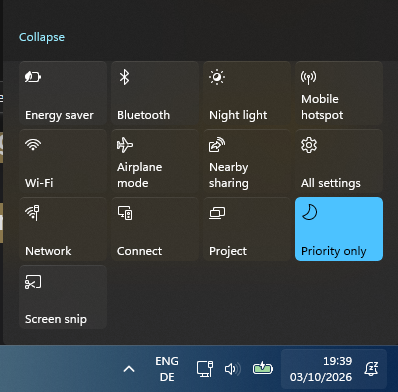

# Windows 11 Action Center Style for Windows 10

Bring a **Windows 11-inspired Action Center** to **Windows 10** using Windhawk!

> [!IMPORTANT]
> ### 📜 Credits & Licensing
>
> The original code was **not written by me**.
>
> The code was sent to me by **xuelan9537 on Discord**. I modified and adjusted it and am redistributing my modified version through this GitHub repository.
>
> Credit for the original code goes to its respective creator(s), with special thanks to **xuelan9537** for sharing it with me.
>
> **Please note:** I do not claim ownership of the original code. Any modifications made by me are provided as-is. Please respect the licensing and rights of the original author(s).

## 🖼️ Preview

> A preview of the Windows 11-inspired Action Center running on a real machine.

## ✨ About

This style modifies the **Windows 10 Action Center** to give it a more modern, Windows 11-inspired appearance.

It includes **rounded corners** and other visual tweaks based on the Windows 11 design language while keeping the functionality of the original Windows 10 Action Center.

## ✨ Features

- 🪟 Windows 11-inspired Action Center design
- ⭕ Rounded corners
- 🎨 Modernized Windows 10 Action Center appearance
- 🧩 Designed for use with Windhawk
- 💻 Keeps the functionality of the original Windows 10 Action Center

## 📢 How to Set Up

1. Download and install **Windhawk** from `https://windhawk.net/`.
2. Launch Windhawk and head to the **Explore** tab.
3. Search for **Windows 11 Notification Center Styler** and install it.
4. After installing, open the mod and go to the **Advanced** tab.
5. Click  on Mod Settings Textbox.
7. Copy and paste the code from `Windhawk-Mod.txt`.
8. Click **Save**.

That's it! Your Windows 10 Action Center should now have the customized Windows 11-inspired appearance.

## 📋 Requirements

- **Windows 10**
- **Windhawk**
- **Windows 11 Notification Center Styler** Windhawk mod

## ⚠️ Disclaimer

This project is an unofficial community modification and is **not affiliated with or endorsed by Microsoft or Windhawk**.

Compatibility may vary depending on your Windows 10 version, Windhawk version, and other installed modifications, tho this does work on Windows 10 22H2.

---

Enjoy a bit of the **Windows 11 look while staying on Windows 10!** 🪟✨
